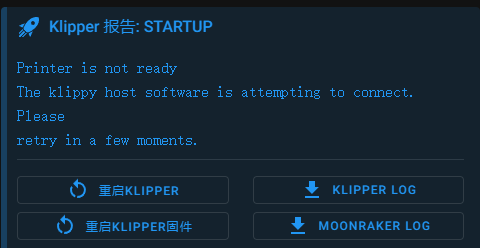
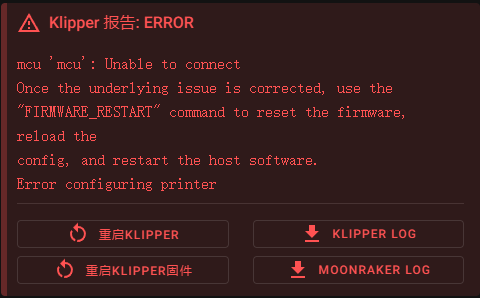
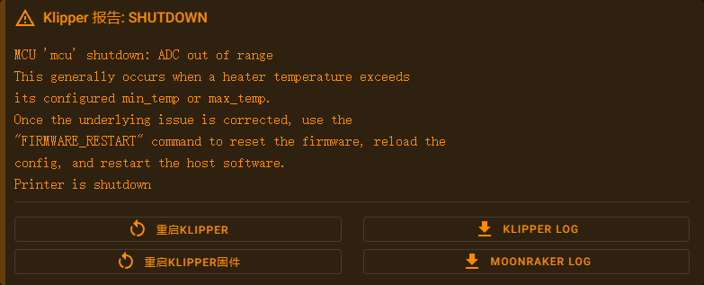
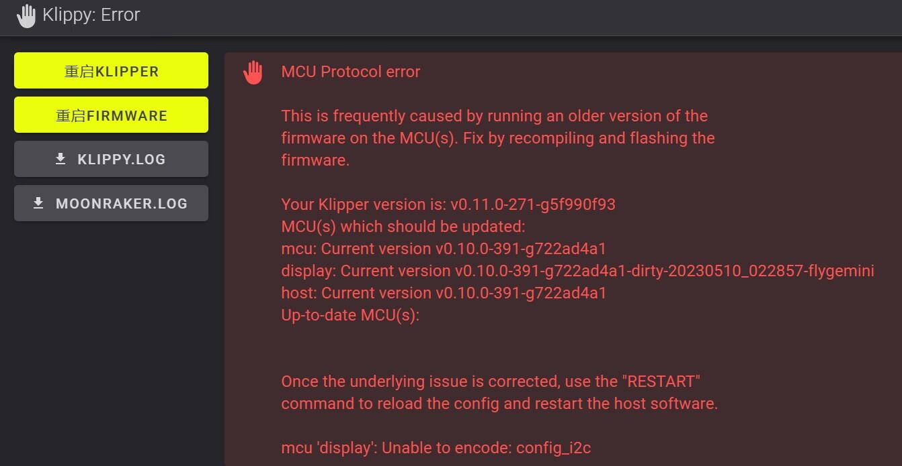

# 设备连接

## Printer

### 1. 报错信息



### 2. 报错原因

系统正在连接下位机

### 3. 解决方法

等待

如果时间过久需要查看**klippy.log**查看原因

## mcu 'xxxx': Unable to connect

### 1. 报错信息



### 2. 报错原因

上位机无法连接到主板

### 3. 解决方法

1. 检查**连接线**是否正常连接
2. 查看**固件编译参数**与官网提供是否一致
3. 通过SSH软件等查看是否可以找到设备，如果可以找到设备`请检查配置里面的ID是否正确`


## Error 'MCU 'mcu' shutdown: ADC out of range....

### 1. 报错信息



### 2. 报错原因

Klipper 检测到温度超过最大或最小阀值（热敏电阻可能开路或者短路），系统将进入关闭保护模式。

### 3. 解决方法

1. 检查热敏型号是否正确
2. 检查热敏Pin脚是否正确
3. 检查热敏是否有短路

## 警告 "relative_reference_index"

### 1. 报错信息


### 2. 报错原因

在 Klipper Jun 20, 2023 的 [更新](https://github.com/Klipper3d/klipper/commit/8fe18f27a94df0a9d394824a3e648ee7f8fc280a) 中，弃用 `relative_reference_index` 选项，使用 `zero_reference_position` 选项代替，如果不升级配置文件可能会导致 z-offset 配置失效问题。

### 3. 解决方法

```
[bed_mesh]
relative_reference_index: 7  # 第多少个点作为±0.00  （最好将点位设置在热床中间或者较平处）（解决热床校准之后在空中的问题）
```

把 **[bed_mesh]** 中的**relative_reference_index**配置完全删除


## MCU Protocol error

### 1. 报错信息



### 2. 报错原因

因为更新**Klipper**导致系统固件版本与下位机固件版本差距过大需要**更新固件**

### 3. 解决方法

重新刷写主板固件，最好全部下位机都**重新编译并且刷写固件**


## MCU 'mcu' shutdown: Timer too close
### 1. 报错信息


### 2. 报错原因


### 3. 解决方法
