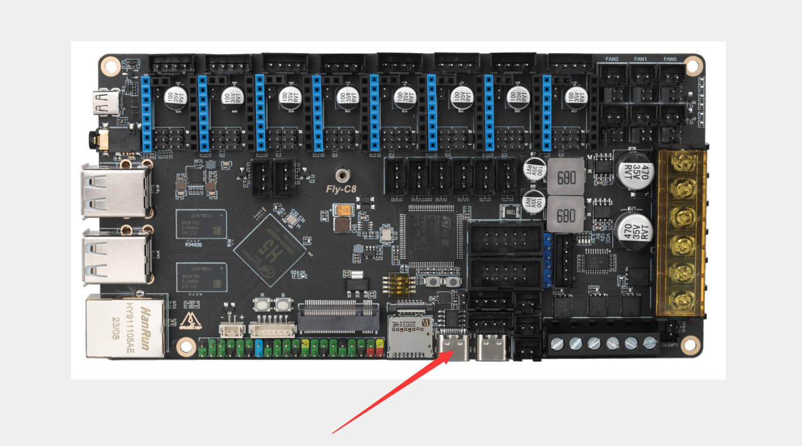
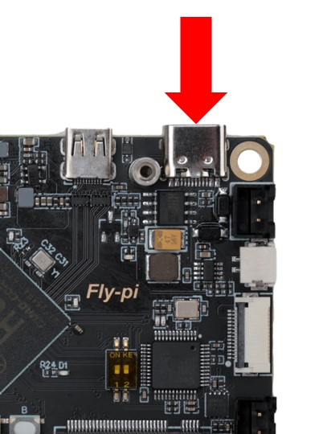
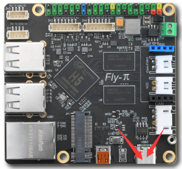
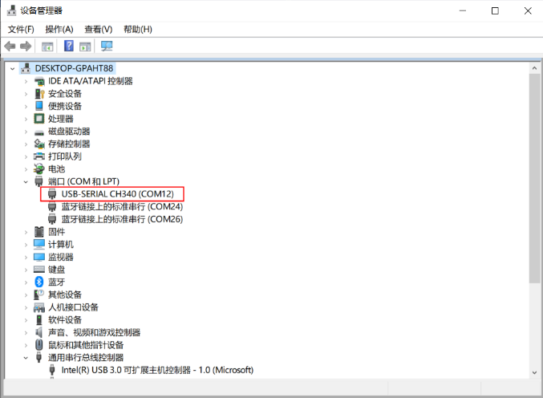
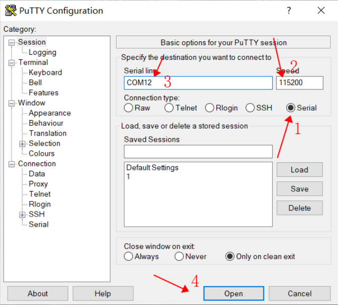
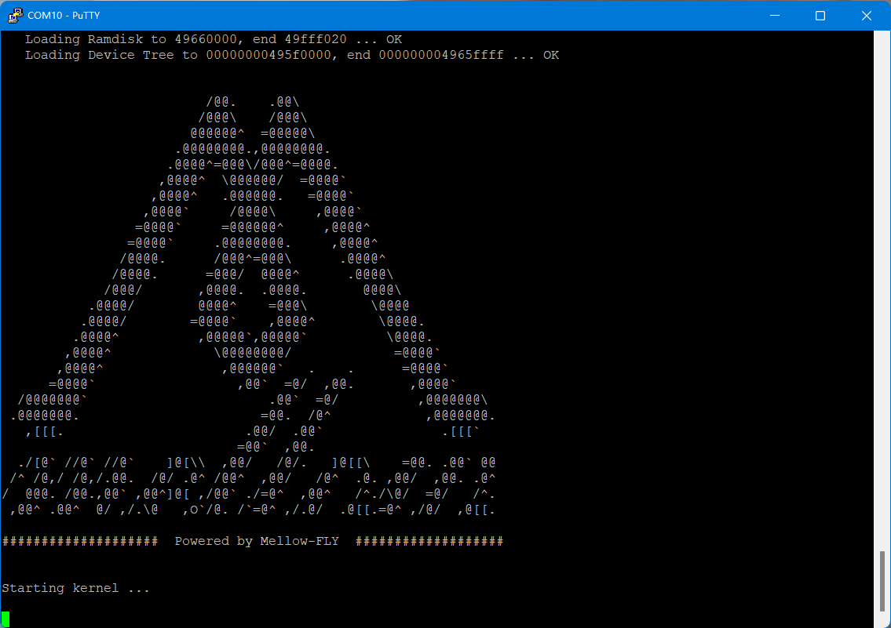
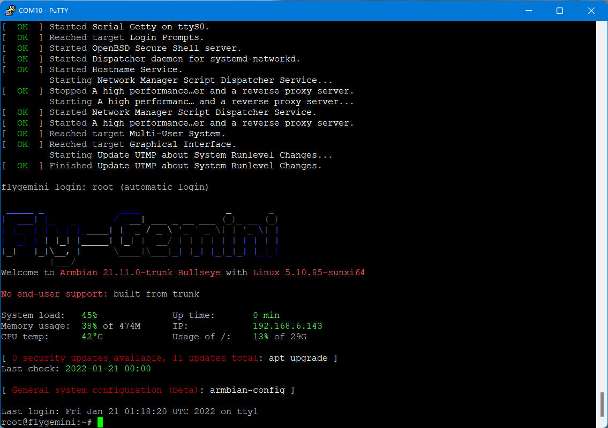

* 可以使用串口与WIFI连接到设备

* 请提前准备好Putty或其他SSH终端工具

* 请确定SD卡或者M2WE有烧录对应上位机的系统

* **请把驱动，限位，风扇，等外设拆除！！！**

# 通过串口连接确定

* 使用USB Type-c线材将FLY-上位机与电脑连接

* 如果主板与电脑连接正常，打开设备管理器，就可以看到CH340的端口了

* 打开Putty，进行如下设置,端口填写前面在设备管理器看到的端口

* 一切正常的话就可以看到启动画面了

* 等待片刻，出现这个画面就是启动了

* 请确保系统盘已经正常烧录！！！
* 如果不确定系统盘是否烧录成功可以直接将sd卡接但电脑上查看是否有boot盘弹出！！！
* 系统未启动可以按上位机重置键，判断系统是否启动！！！
* 确定了系统盘烧录正常，并且ssh连接正常但是没有任何信息显示，请直接咨询客服！！！

> 如果是主板启动很久后才连接的SSH那么请连接后按几下回车键

> [!Warning]
>
> 如果没有正常启动，请截屏下来并且发给客服咨询
