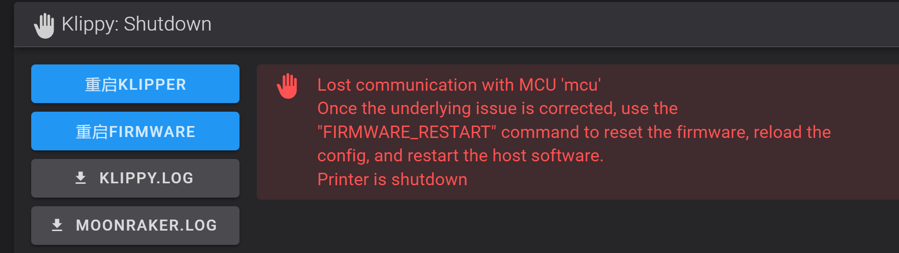
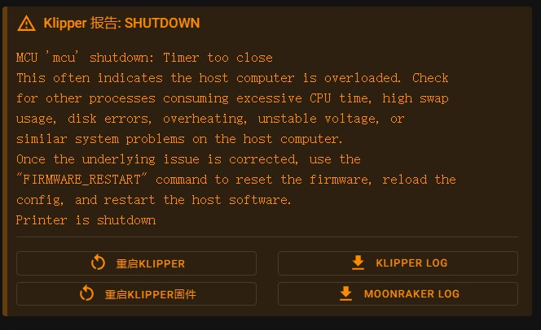

# CAN的报错

在Klipper中使用CAN工具板可能导致以下三种报错

* MCU 'xxx' *shutdown*: *Timer too close* This often indicates the host computer is overloaded 
* lost communication with mcu 'xxx'
* Missed scheduling of next digital 

# 可能原因

* 上位机和 MCU 之间的连接不可靠
* 电源不足/过载/过热等等
* 连接线松动
* CAN缓存不足
* 使用驱动的细分太高

# 潜在的解决方案

- 修改CAN缓存，至少修改成1024
- 降低驱动细分最好16
- 检查硬件/电缆/连接器。整个打印机中的任何电缆都可能导致短路，从而可能导致 MCU 崩溃或者短连
- 确保上位机、主板与CAN使用质量好的电源装置并且**最好供地**
- CAN阻值没有处于`60Ω`需要CAN H与CAN L在断电情况下使用万用表量阻值
- 当打印非常热时（挤出机和/或床），所需的电流可能会使电源过载。降低温度，如果错误消失，则说明所用电源太弱
- 主机或主电源供电不足/过载
- 其他 USB 设备（例如摄像头）占用 USB 通信

* 请注意TTC一般是系统方面问题建议更换系统或者重新安装系统