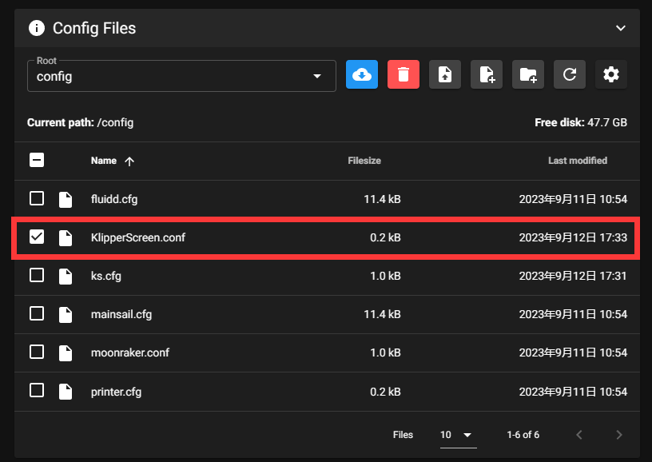
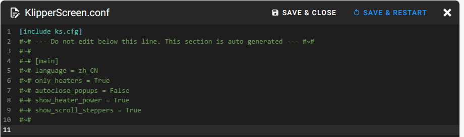
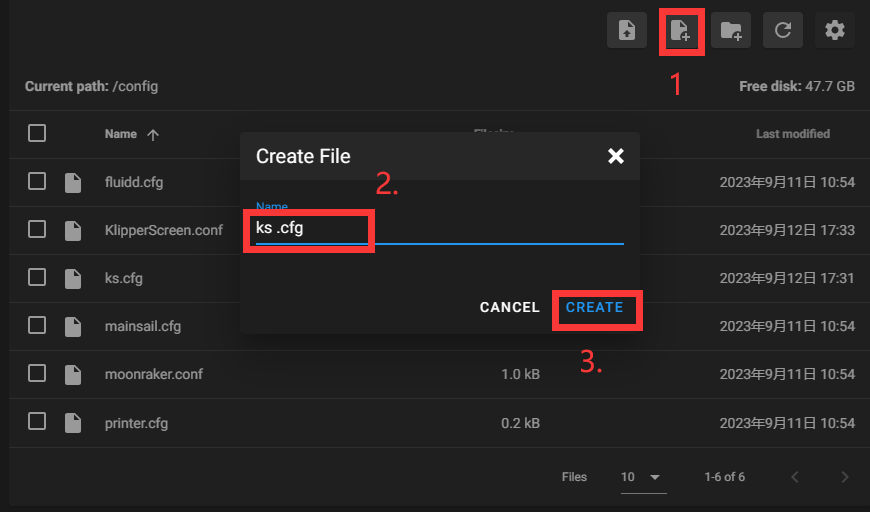

>[!Warning]
>
>请注意使用此方法可以使让远程屏幕关闭其他上位机电源，关闭远程屏幕时候请注意关闭的机器否则可能会对其他机器造成不可逆伤害，本文不对由此造成的损失负责

此方法可以将多于的上位机利用起来，要求如下

* 远程控制的上位机需要带触摸屏幕
* 上位机安装好klipper 、moonraker、klipper-screenl、mainsail或者fulidd、
* 需要被连接的机器可以正常使用Klipper
* 需要连接的上位机需要在同一局域网下
* 会查找被控制的上位机IP

远程连接方法如下，此方法合适所有符合上方要求的机器

1. 打开网页找到机器配置，找到`KlipperScreen.conf`，此文件是安装好KlipperScreen后自动生成的。



2. 添加引用，ks.cfg可自行重命名，然后添加新配置。

```
[include ks.cfg]
```





3. 打开`ks.cfg`并且添加以下配置，可以修改`VORON-300`打印机名称与 `192.168.6.217`需要连接的机器。

>[!Warning]
>
>请注意第二个`[printer KlipperScreen]`是为了连接远程扩展的上位机，可以连接此配置进行调试或者关机

```
# Define printer and name. Name is anything after the first printer word
[printer VORON-300]
# Define the moonraker host/port if different from 127.0.0.1 and 7125
moonraker_host: 192.168.6.217
# ports 443 and 7130 will use https/wss
moonraker_port: 7125
# Moonraker API key if this is not connecting from a trusted client IP
moonraker_api_key: False

# Define printer and name. Name is anything after the first printer word
[printer KlipperScreen]
# Define the moonraker host/port if different from 127.0.0.1 and 7125
moonraker_host: 127.0.0.1
# ports 443 and 7130 will use https/wss
moonraker_port: 7125
# Moonraker API key if this is not connecting from a trusted client IP
moonraker_api_key: False
```

保存配置，然后在右上角重启KlipperScreen服务或者重启机器即可。
