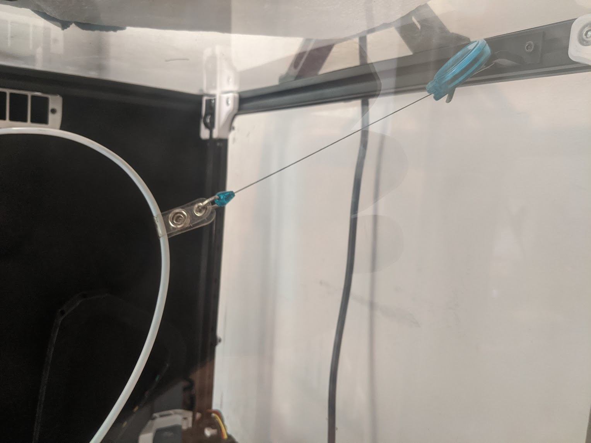
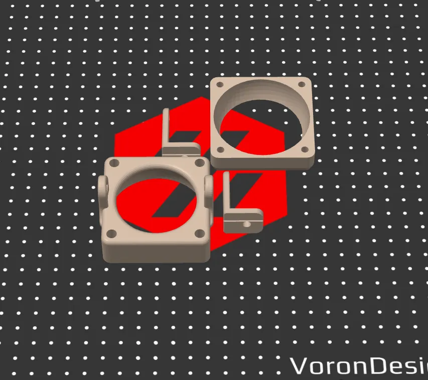
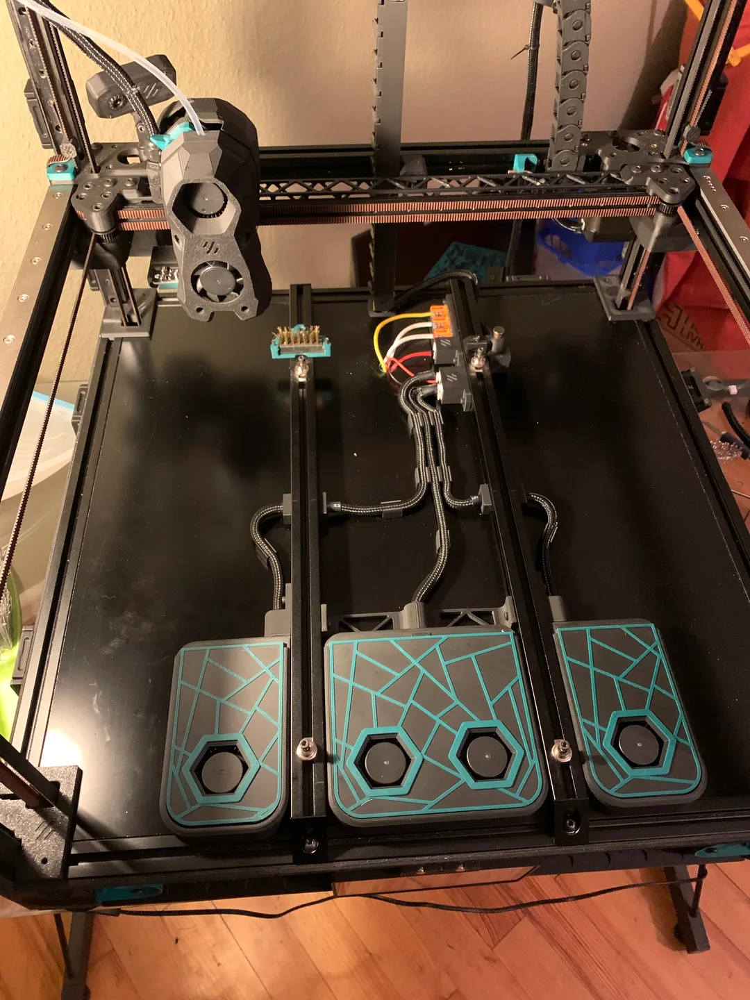

# 3D打印机相关MODS项目汇总

本页主要收录一些3D打印机相关的MODS项目。

## Voron

VORON的仓库地址

项目地址：[VoronDesign (github.com)](https://github.com/VoronDesign)

# 打印机改造

## Badge_Retractor_Mount：可用与拉辫子

只是一个简单的小模组，可以使用可伸缩的胸卡夹扣。提供多个角度。

项目地址：[VoronUsers/printer_mods/Ellis/Badge_Retractor_Mount at master ·VoronDesign/VoronUsers (github.com)](https://github.com/VoronDesign/VoronUsers/tree/master/printer_mods/Ellis/Badge_Retractor_Mount)

## 小米摄像头标准版2k支架

可将小米摄像头固定到支架上的模型

项目地址：[小米摄像头标准版2k固定支架 by fenghua | Download free STL model | Printables.com](https://www.printables.com/model/662243-xiao-mi-she-xiang-tou-biao-zhun-ban-2kgu-ding-zhi-)

## THE FILTER, for Voron 2.4：过滤器

类似Nevermore的过滤器

项目地址[VoronUsers/printer_mods/nateb16/THE_FILTER at master ·nateb16/VoronUsers (github.com)](https://github.com/nateb16/VoronUsers/tree/master/printer_mods/nateb16/THE_FILTER)

