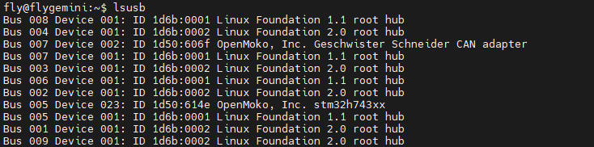
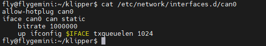

## 如何查找设备

查找 USB 串行端口的一般方法是从主机上的SSH终端运行`lsusb`，它会产生类似于以下内容的输出



`OpenMoko, Inc. stm32h743xx`属于**USB固件**是你的下位机刷了正确的**USB**固件才会显示，如果**刷错固件**或者**未刷固件**则**不会显示设备**或者**显示其他设备**。

`OpenMoko, Inc. Geschwister Schneider CAN adapter` 属于**CAN固件**是你的下位机刷了**CAN固件或者CAN桥接固件和接了UTOC**才会显示

### 搜索USB固件ID

查找 USB固件ID 的一般方法是从主机上的 ssh 终端运行此指令

```
ls /dev/serial/by-id/*
```

它会产生类似于以下内容的输出：


在上述命令中找到的名称是稳定的，可以在配置文件中使用它

更新后的配置如下所示：

```
[mcu]
serial: /dev/serial/by-id/usb-Klipper_stm32h743xx_1B0044000A51303435393237-if00
```


### 搜索CAN固件ID

#### 检查设备是否支持CAN

非FLY上位机的，请注意检查自己烧录的镜像内核是否支持CAN，如果不支持则无法使用CAN。检测方法如下。

在SSH输入：

```
sudo modprobe can && echo "您的内核支持CAN" || echo "您的内核不支持CAN"
```

输入以上指令后，如果您的内核支持CAN就会返回：`您的内核支持CAN`；如果不支持就会返回：`您的内核不支持CAN`。

#### 确认CAN速率

```
cat /etc/network/interfaces.d/can0
```



图中的**1000000**是上位机设置的**can速率**，**1024**是**CAN的缓存**。

下方指令是将**1M**速率修改成**500K**修改后需要**重启系统**

```
sudo sed -i 's/1000000/500000/g' /etc/network/interfaces.d/can0
```

[树莓派CAN使用](/advanced/can_rpi.md)

#### 查询CANID

查找 CANID的一般方法是从主机上的 ssh 终端运行此指令

```
~/klippy-env/bin/python ~/klipper/scripts/canbus_query.py can0
```


## 警告 "relative_reference_index"

#### 1. 报错信息：


#### 2.报错原因

在 Klipper Jun 20, 2023 的 [更新](https://github.com/Klipper3d/klipper/commit/8fe18f27a94df0a9d394824a3e648ee7f8fc280a) 中，弃用 `relative_reference_index` 选项，使用 `zero_reference_position` 选项代替，如果不升级配置文件可能会导致 z-offset 配置失效问题。

#### 3. 解决方法

```
[bed_mesh]
relative_reference_index: 7  # 第多少个点作为±0.00  （最好将点位设置在热床中间或者较平处）（解决热床校准之后在空中的问题）
```

把**[bed_mesh]**中的**relative_reference_index**配置完全删除
