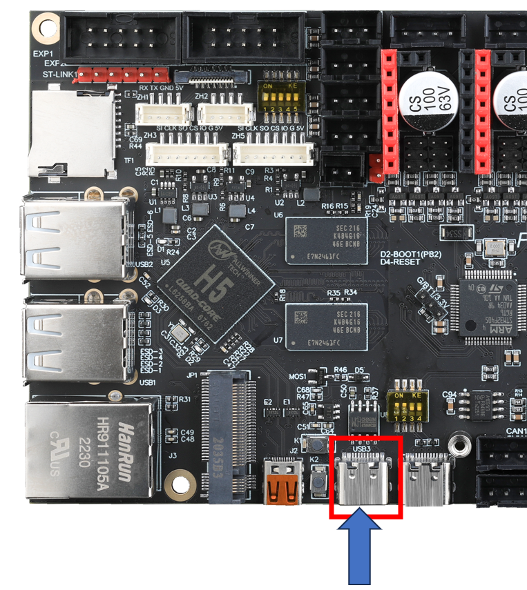

# 上位机连接SSH

* 可以使用串口或者WIFI连接到设备
* 请提前准备好**MobaXterm_Personal**或其他**SSH终端工具**

* 请确定SD卡或者M2WE有烧录**对应上位机的系统**

* **如果上位机不能正常启动请把驱动，限位，风扇，等外设拆除！！！**


<!-- tabs:start -->

## **通过串口连接**

* 使用USB Type-c线材将FLY的上位机与电脑连接
* 其他上位机请自行查询连接方法！！





* 如果主板与电脑连接正常，打开设备管理器，就可以看到CH340的端口了


* 打开``MobaXterm``，进行如下设置，端口选择前面在设备管理器看到的端口


* 一切正常的话就可以看到启动画面了


* 等待片刻，出现这个画面就是启动了


**如果等了几分钟后，像下图一样，界面没有任何显示，按几下回车键即可**


**回车后会出现下图所示内容**


* 这时候需要切换用户，在ssh中输入：``su fly`` 后 再输入 ``cd ~``


* 在终端中输入命令```ip a|grep inet```回车，在返回内容中找到与你路由器同段的IP即可访问


## **通过WIFI或者网线连接上位机**

* 请登录上位机连接的**路由器后台**
* 请确保系统已经**正常启动**
* 请确保**自己知道上位机的用户名与密码**，FLY系统默认用户名**fly**默认密码**mellow**
* 如果主板已经启动且已经连接到网络，可以使用IP连接到SSH
* 打开MobaXterm，进行如下设置，IP填写前面查看的，也可以在路由器后台查看


**注意：这里第4步输入的上位机的用户名**


* 第一次连接回弹出这个窗口，点击``Accept``即可


* 提示输入密码，输入上位机密码后回车

**注意：这里输入的密码是看不到的，输完后直接回车即可**

FLY系统默认，用户名为：``fly`` ，密码为：`` mellow``


* 登录成功


<!-- tabs:end -->

