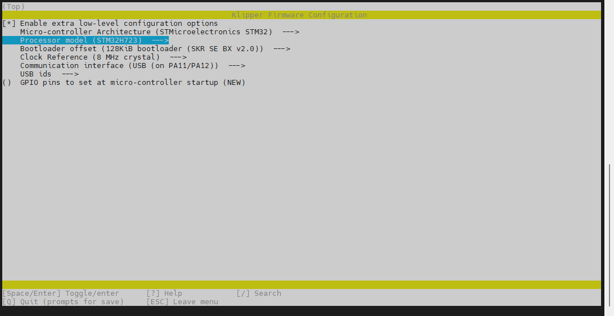
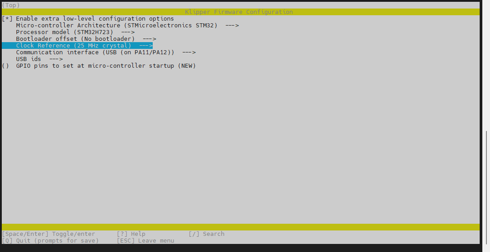
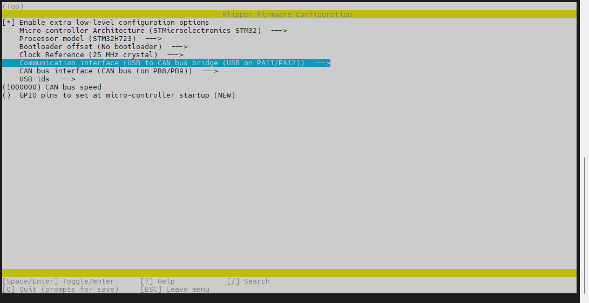
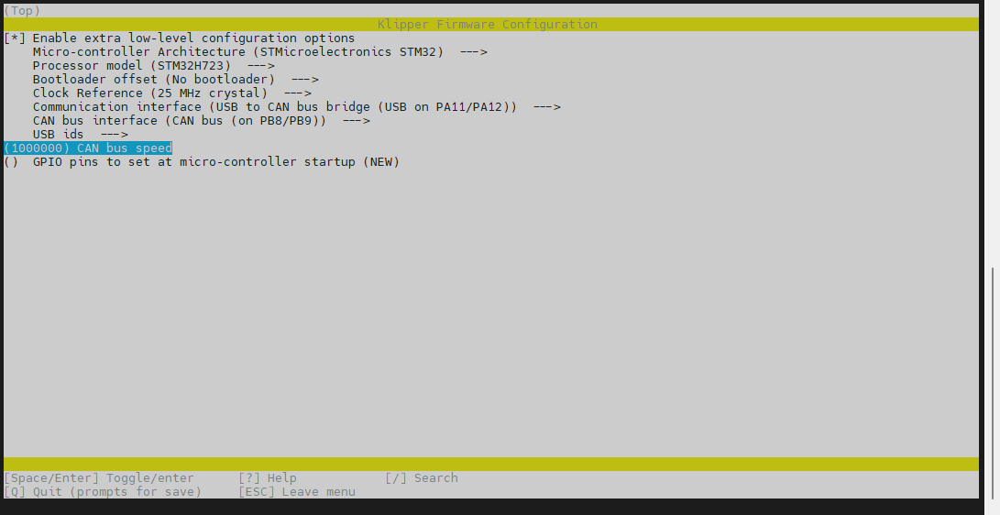
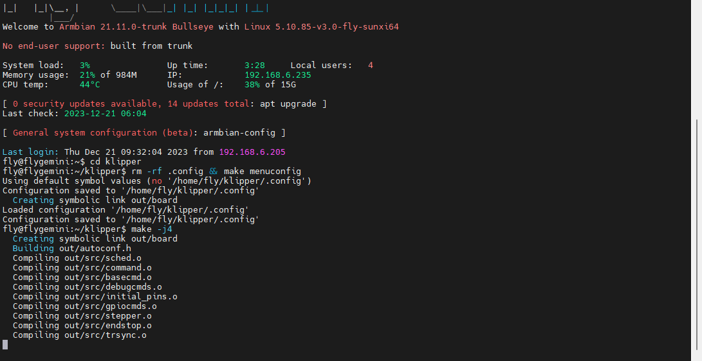

## 编译Klipper固件

固件编译将使用SUPER8-PRO**桥接CAN工具板固件**为例

请使用**MobaXterm_Personal**等**SSH工具**连接通过**WIFI**到您的上位机，并且需要确定以下几点

1. **请先保证上位机已经[连接到SSH](introduction/conntossh)**
2. **请确保上位机安装好了Klipper固件**
3. **请确保登录的用户必须是安装好Klipper的用户**
4. **请确保你的输入法是英文**
5. **请确保你的上位机可以正常搜索到设备**
6. **请确保以上注意事项都做到，否则无法进行下一步**

* **上位机连接SSH**后输入`cd klipper`并且**回车**


* 输入`rm -rf .config && make menuconfig`，并且**回车**


* **回车后**将出现下面界面


* 选择`Enable extra low-level configuration options`并且**回车**，此项是打开其他配置选项


* 选择`Micro-controller Architecture`此项并且**回车**，此项是选择**下位机主控类型**！！！
* 给Klipper机器一般使用`STM32`与`RP2040`这两种主控类型


* 选择`STMicroelectronics STM32`并且**回车**，然后需要选择**对应主板主控型号**!!!




* `Bootloader offset`为引导偏移此项需要查看主板对应主板提供的参数来选择！！！
* 如果选择`No bootloader`则代表使用**DFU**烧录固件，会把原来**使用内存卡烧录引导**删除！！！
* 如果需要内存卡烧录请选择`128K`，请注意其他主控请按对应固件配置来选择！！！
* 选择`Clock Reference`此项需要查看主板对应主板提供的参数来选择！！！



* 选择` Communication interface `并且**回车**找到`USB to CAN bus bridge (USB on PA11/PA12)`然后回车选择此项目！！！



* FLY主板的CAN口默认`CAN bus (on PB8/PB9)`此项不需要修改
* 请注意` CAN bus speed`是CAN速率，上位机的CAN速率与下位机CAN速率要**一致**
* ` CAN bus speed`可自行设置默认为`1000000`



* `GPIO pins to set at micro-controller startup (NEW)`一般是用于判断主控是否有启动固件
* 输入小写英文`q`和`y`保存并且退出固件参数选择
* 输入`make -j4`并且**按回车进行固件编译**



* 出现`Creating hex file out/klipper.bin`代表**固件编译成功**


## 烧录固件到主板

使用**MobaXterm_Personal**左边文件目录找到`klipper`选择然后找到`out`打开

并且将`klipper.bin`复制到SD卡


1. 准备一张SD卡**不得大于32G！！！**，并且格式化成FAT32格式
2. 将klipper.bin复制到SD卡，并且重命名为```firmware.bin```


3. 主板断电，将SD卡插入主板
4. 给主板上电，等待10秒左右
5. 取下SD卡，插入电脑。如果SD卡中的看**firmware.bin**消失，出现```FLY.CUR```就是烧录成功了

