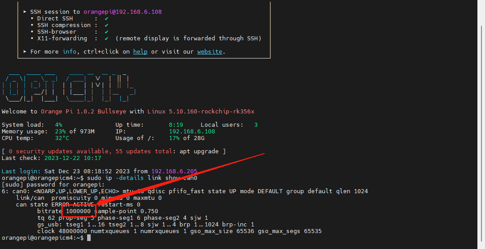

# 如何搜索ID并且将ID配置到Klipper

请使用**MobaXterm_Personal**等**SSH工具**连接通过**WIFI**到您的上位机，并且需要确定以下几点

1. **请确保上位机安装好了Klipper固件**
2. **请确保登录的用户必须是安装好Klipper的用户**
3. **请确保你的输入法是英文**
4. **请确保你的上位机可以正常搜索到设备**
5. **请确保以上注意事项都做到，否则无法进行下一步**
6. **请确保下位机连接上位机的数据线具有数据传输功能**

如何连接[连接到 SSH](http://mellow.klipper.cn/#/introduction/conntossh)

# 确定上位机是否连接到下位机

* **SSH连接**连接到上位机后输入`lsusb`并且**回车**，将可能出现下面几种设备
* 请确保**下位机连接上位机的数据线**具有数据传输功能
* 如果系统不支持`lsusb`可以执行下方指令进行安装

```
sudo apt-get install usbutils
```


`OpenMoko, Inc. stm32h743xx`属于**USB固件**是你的下位机刷了正确的**USB**固件才会显示，如果**刷错固件**或者**未刷固件**则**不会显示设备**或者**显示其他设备**。

`OpenMoko, Inc. Geschwister Schneider CAN adapter` 属于**CAN固件**是你的下位机刷了**CAN固件或者CAN桥接固件和接了UTOC**才会显示，如果**刷错固件**或者**未刷固件**则**不会显示设备**或者**显示其他设备**。

* CAN设备使用**并联其他的CAN设备**，而不是接到上位机则**只有一个CAN设备**

**如果没有这两个设备有以下几种可能**

* 下位机**没刷固件**或者**刷错固件**
* **使用的数据线可能没有数据传输功能**
* **上位机USB口故障**
* FLY主板，例如：双子座系列,C8系列需要打开拨码才可以连接到上位机
* **接错线导致下位机进入短路保护模式**，请注意建议将**下位机的全部外设拆除限位，风扇，驱动等等！！！**
* 如果是STM32主控下位机处于**DFU**模式，请将**DFU**跳线去除后**重新给下位机通电**
* 如果是RP2040主控下位机处于**RP2 BOOT**模式，请将**BOOT**跳线去除后**重新给下位机通电**

# 搜索设备ID

* 请注意USB固件只能使用USB的搜索方式，是无法搜索到CAN ID
* 请注意CAN固件只能使用CAN的搜索方式，是无法搜索到USB ID

## 搜索USB固件ID

查找 USB固件ID 的一般方法是从主机上的 ssh 终端运行此指令

```bash
ls /dev/serial/by-id/*
```

它会输出以下类似于内容：


* 请注意输出的ID必须带有`usb-Klipper`否则可能是**其他固件的ID**，可能**无法使用**！！

在上述命令中找到的名称是稳定的，可以在配置文件中使用它，配置方法请看**最下方**

## 搜索CAN固件ID

* 以**UTOC**和刷了**CAN桥接固件的主板**为例
* 请在**完全断电**情况下，将CAN的H与CAN的L接好使用**万用表量CAN的H与L阻值**
* 如果**两端120R跳线都接上阻值应该在60**左右
* 请确保**UTOC**或者**CAN桥接固件的主板**是已经**连接到上位机**，输入`lsusb`后有输出以下内容

```
OpenMoko, Inc. Geschwister Schneider CAN adapter
```


**搜索CAN的ID之前请确保以下几点**

* **CAN速率是否一致**，请确保**上位机的CAN速率**与**下位机固件的CAN速率要一致**
* 请在**完全断电**情况下，**CAN的H与L的阻值应该在60**左右

### 上位机CAN速率查询方法

上位机连接SSH后输入`sudo ip -details link show can0`回车输入你上位机的密码，将**输出以下内容**

* 下图圈起来的地方为**上位机CAN速率**



### 搜索CAN固件的ID

查找 CANID的一般方法是从主机上的 ssh 终端运行此指令

```bash
~/klippy-env/bin/python ~/klipper/scripts/canbus_query.py can0
```


以下几种情况可能导致无法搜索到CANID

* Klipper之前连接过CAN设备，可以**将配置里面的ID屏蔽后彻底断电重启**
* UTOC使用typec供电足够，但是刷了**CAN桥接固件的主板**可能需要将`电源口接上电源`才可以搜索到ID
* **CAN速率不一致**
* **CAN的H与L阻值不在60R左右**
* **上位机不支持CAN**
* **下位机没刷对固件**
* 非FLY上位机的，请注意检查自己烧录的镜像内核是否支持CAN，如果不支持则无法使用CAN。检测方法如下。

在SSH输入：

```bash
sudo modprobe can && echo "您的内核支持CAN" || echo "您的内核不支持CAN"
```

# Klipper配置ID方法

* 在**浏览器中输入上位机的IP**,然后打开配置找到并且打开`printer.cfg`

## USBID配置方法

找到`[mcu]`将搜索到的ID填写到`[mcu]`下面

```
[mcu]
serial: /dev/serial/by-id/usb-Klipper_stm32H743xx_500025000151323032333133-if00
```

## CANID配置方法

```
[mcu]
canbus_uuid: c5d882c0d121
```

## 多个MCU配置方法

注意事项

* 主MCU得配置一个`[mcu]`，其他的MCU配置需要添加`[mcu sht36]`其中的sht36是你指定的MCU名字这是可以更改的！！

```
[mcu]
serial: /dev/serial/by-id/usb-Klipper_stm32H743xx_500025000151323032333133-if00

[mcu sht36]
canbus_uuid: c5d882c0d121
```

* 调用其他MCU引脚方法，以LED灯珠配置为例
* 这样是默认调用主MCU的PB0端口

```
[neopixel sb_leds]
pin:PB0
chain_count: 3
color_order: GRB
initial_RED: 0.4
initial_GREEN: 0.8
initial_BLUE: 1
initial_WHITE: 0.0
```

* 如果需要调用工具板的端口则需要在`pin:PB0`的`pin:`后面添加其他MCU名字，下方是示例配置
* 这样写就可以告诉klipper，我需要调用sht36的PB0端口，其他配置同理

```
[neopixel sb_leds]
pin: sht36:PB0
chain_count: 3
color_order: GRB
initial_RED: 0.4
initial_GREEN: 0.8
initial_BLUE: 1
initial_WHITE: 0.0
```

