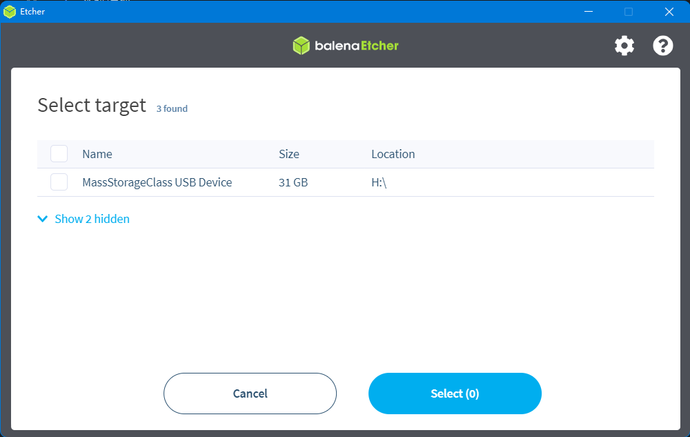

# 系统镜像

> 购买时选择了SD卡套餐可以跳过这部分

## 准备

* 需要的东西
  
1. SD卡一张（>8GB）
2. 读卡器
3. 系统镜像

下载需要用到的工具和文件，国内用户请前往QQ群下载

* [工具](https://drive.google.com/drive/folders/1llH-lq-WsbIdwkmLL51n3OHo5dNNpcPy)
* [系统镜像](./downloadimg.md)

## 烧录SD卡

* 先安装好软件“balenaEtcher”，也可以用其他的(Win32DiskImager)等工具
* SD卡插入读卡器，将读卡器插到电脑USB接口
* 打开软件，点击“Flash from file”选择前面下载的系统镜像文件
* 

* 点击“Select target”选择SD卡，大小和SD卡容量差不多的就是，或进入资源管理器查看SD卡盘符

* 点击“Falsh”,出现进度条及“Falshing...”时开始写入系统镜像到SD卡
* 等待写入完成，可跳过验证步骤，弹出你的SD卡

* 到这里您的SD卡已经可以插入Gemini等主板启动了

> 建议您在启动前认真阅读[FLY-Config](/fly_config/README)部分
