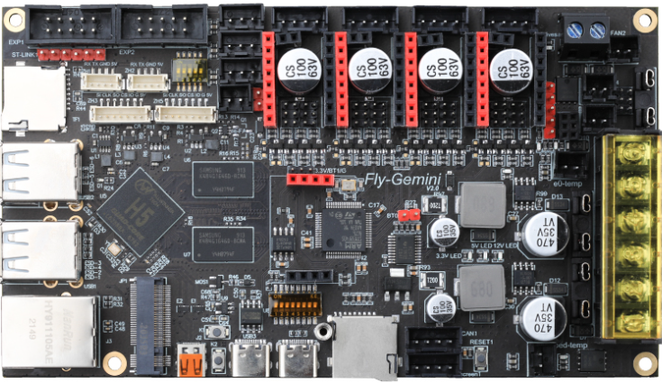
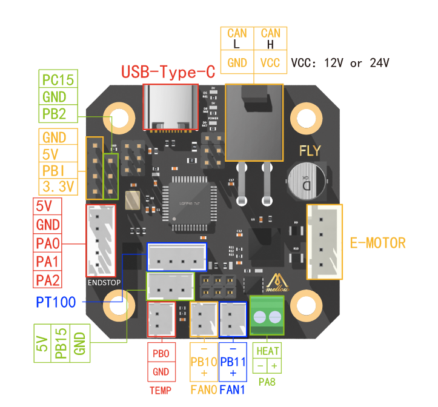
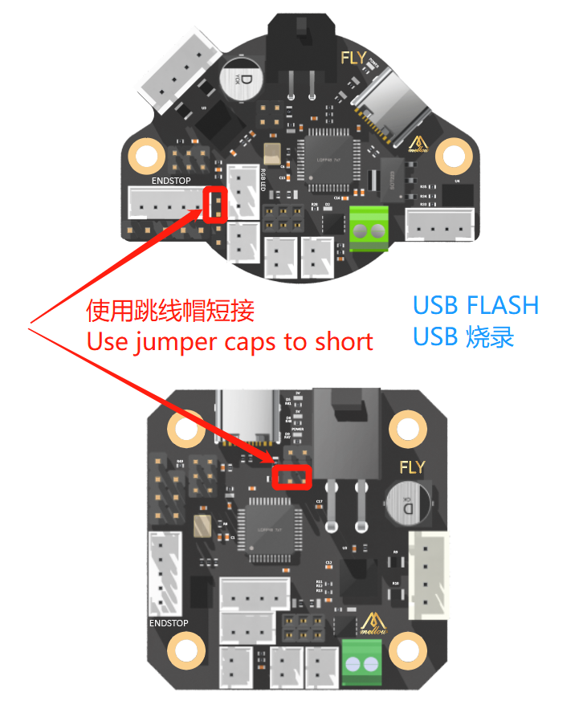
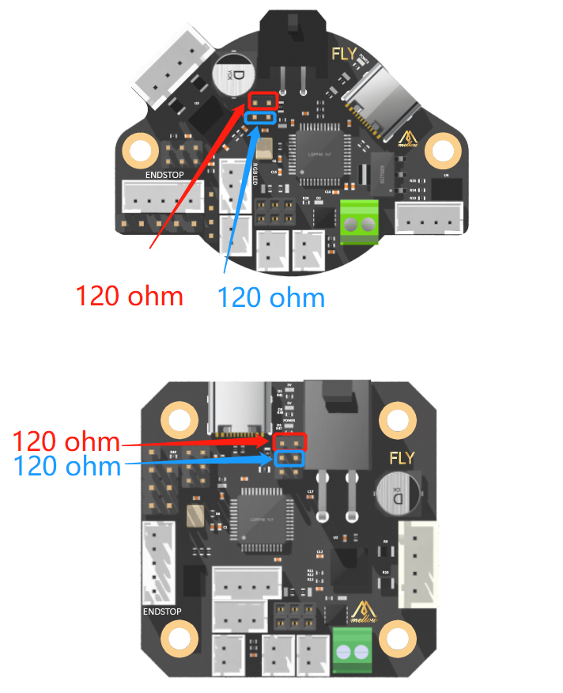

# Gemini_V2-CAN的配置详细流程
**全程参考官网：** [mellow.klipper.cn](https://mellow.klipper.cn/)

?> 本文提供了<font style="background:yellow">软件</font>，<font style="background:yellow">镜像</font>，以及编译好的<font style="background:yellow">klipper固件</font>,方便一次性下载。

<div id="Article">
        <tr style="box-sizing: border-box">
            <td style="box-sizing: border-box" colspan="2">
            <table style="box-sizing: border-box; background-color: transparent; border-spacing: 0px; border-collapse: collapse; max-width: 100%" cellpadding="10">
                <tbody style="box-sizing: border-box">
                    <tr style="box-sizing: border-box">
                        <td style="box-sizing: border-box;">
                        <a href="https://drive.google.com/drive/folders/1GtRI1C0IcE3mND4UErnZyka3ZrgK1Vmm" target="_blank" >
                        </a></td> 
                        <td style="box-sizing: border-box">
                        <a href="https://pan.baidu.com/s/1SHc_n0J157p1p5Y2r8Q-0w?pwd=fly8" target="_blank" >
                        </a></td>
                        <td style="box-sizing: border-box"><a href="https://www.aliyundrive.com/s/gCb2iCpbaYA" target="_blank"></a></td>
                    </tr>
                    <tr style="box-sizing: border-box" align="center">
                        <td style="box-sizing: border-box; "><strong style="box-sizing: border-box">Google Drive</strong></td>
                        <td style="box-sizing: border-box"><strong style="box-sizing: border-box; line-height: 22px">百度云盘</strong></td>
                        <td style="box-sizing: border-box"><strong style="box-sizing: border-box; line-height: 22px">阿里云盘</strong></td>
                    </tr>
                </tbody>
            </table>
            </td>
        </tr>
    </tbody>
</table>
</div>

## 1.物品准备
> 本文中使用的是**SHT42** 

> 按照官网的说明FLY-SHT36与SHT42除了外形不同外，接口配置完全一致
* ### 硬件
  
  
  
  ​          **<center><font size=4>UTOC-1</font></center>**
  
  **<center><font size=4>SHT42</font></center>**
  
  
  
* ### 线材

  * 18awg x 5m 黑色

  * 18awg x 5m 红色
  
  （长度可按需求，一般这些就够了）

  * 叉型冷压端子若干(如图线材主要用于：
  
    


   > <div>
    a.**UTOC**的供电<font color=red>2根线</font>(<font color=red>24V</font>/<font color=black>GND</font>)</br>
     b.**SHT42**与 **UTOC**进行CAN通讯的<font color=red>4根线</font>(CAN L / <font color=red>CAN H</font> / <font color=red>24V</font>/ GND)
     </div>

* ### 工具
  * 4.2mm 5557 端子 压线钳
  
  * ot 冷压端子 压线钳

## 2.电气接线部分

   ***接线方式有很多种，这里仅仅展示一种情况，其他都可以根据CAN的功能进行类比。***

  * ### 制作CAN的4线通讯线（以 **UTOC** 和 **SHT42** 为例）
    * 2x2p的 5557 端子，在购买的SHT42板的包裹中已经附带了
    
    
     如图：
    <div align=center>
    
    </div>
    
    > :warning: <font style="background:yellow" color=red>5557 端子 一定要压好，不要让vcc虚连 </font>
    
    * VCC 和 GND，CAN H 和 CAN L 分别对应好位置
    
    <div align=center>
    
    </div>
    
    <div align=center>
    
    </div>
    
    * 接线端子的实际效果：
    <div align=center>
    
    </div>
    
    * 连线的实际效果：
    <div align=center>
    
    </div>
    
    > :warning: <font style="background:yellow" color=red>线序一定不要接错</font>
    
  * ### CAN的VCC取电
    * 连接CAN工具头需要有VCC接入，这里以**UTOC** 取电为例
    <div align=center>
    
    </div>
    <div align=center>
    
    </div>
  * ###  **UTOC** 与 **Gemini** 连接
  <div align=center>
  
  </div>

**<center><u><font size=6>至此接线部分完成</font></u></center>**

## 3.固件刷写
 ***<center>对于购买SD卡套餐的朋友，请直接看<font color=red size=5>[通电测试](/users/geminiv2_can?id=通电测试)</font></center>***

  *  ### linux镜像的刷入
   > :warning: 一定要根据官网提供的<font style="background:yellow" color=red>最新</font>固件:</br>

     下载链接：v2.9 [2022-04-12](https://cdn.mellow.klipper.cn/IMG/Build/FLY-v2.9_Flygemini_bullseye_current_5.10.85.img.xz)

   <div align=center>
   
   </div>
   * 下载后的镜像文件：
   <div align=center>
   
   </div>
   * 通过工具balenaEtcher给sd卡刷入镜像：

   下载链接：[balenaEtcher - Flash OS images to SD cards & USB drives](https://www.balena.io/etcher/)
   <div align=center>
   
   </div>

   <div align=center>
   
   </div>

   <div align=center>
   
   </div>

   * 等待5分钟后刷好后拔下，并直接插入图中所示的linux的SD卡接口。
   <div align=center>
   
   </div>

   > Windows 提示的格式化不要管，直接拔出就行。

     **<center><font size=4><u>至此linux上位机端带有klipper 的系统镜像已经搞定</u></font></center>**

  *  ### 通电测试
     * 图中位置插入SD卡
     <div align=center>
     
     </div>
     * 上电测试：注意这里采用的是USB（ CH340 ）连接的方式。
     
     * 因为刚烧录好的系统，没有配置WiFi
     
     * 有些朋友不从事嵌入式开发，<font color=red>可能需要</font >：Windows下的CH340驱  动，要单独下载，在<font color=red>文章开头</font >的软件包中提供。
     
     > :warning:<font color=red>如果使用12~24V 的VCC取电方式，USB连接一定要断开。</font >

*  ### 终端连接**Gemini**

    下载MobaXterm:[MobaXterm Xserver with SSH, telnet, RDP, VNC and X11 -   Download](https://mobaxterm.mobatek.net/download.html)

    > :warning: 通过MobaXterm 的session里面的serial连接，<font color=red>首先确保没  有接入vcc</font >

    具体步骤：

    * Windows 设备管理器：记住COM号 如图：COM3
    <div align=center>
    
    </div>
    
    * 打开MobaXterm 添加新的session，选择serial
    <div align=center>
    
    </div>

    * 配置波特率<font color=red>115200</font >，连接端口号为刚在<font color=red>设备管  理器</font >记住的端口
    <div align=center>
    
    </div>

    <div align=center>
    
    </div>

    * 这个效果就ok了。

    * 配置WiFi
      * 在MobaXterm终端输入
       ```bash
       nmtui
       ```
      * 激活一个连接
       <div align=center>
       
       </div>
    
      * 输入密码连接，带星号表示连接成功，退出
       <div align=center>
       
       </div>

       <div align=center>
       
       </div>

    > 配置好WiFi后建议通过ssh ip连接获得更好的体验

      MobaXterm 可以更简单的设置好字体，如图：

      由于MobaXterm的特殊性，需要单独为每一个session设置字体和配置相关的设置
    
      <div align=center>
      
      </div>
      <div align=center>
      
      </div>
    
  *  ### 下位机和CAN的配置

      * #### 下位机固件制作+刷写
        ***MobaXterm为例，如果使用putty 还需要winscp，所以这里推荐MobaXterm***

        * 连接ssh，以Mobaxterm为例：

        * 新建一个session，ip在路由器查看，用户名fly 密码mellow （都是小写）

        <div align=center>
        
        </div>

        * 连接

        <div align=center>
        
        </div>

        * 下面开始编译klipper的固件

        * 在linux 命令行中输入（复制后在终端中右键即可粘贴）

        *  依次执行下面的3条命令

            ```bash
            cd ~/klipper/
            ```
        
            ```bash
            make clean
            ```
        
            ```bash
            make menuconfig
            ```

        * 出现klipper 的编译界面下面直接按照我图中所示进行设置：
          <div align=center>
          
          </div>

        * 总共有5个选项通过上下左右键 和回车键进行选择，最后的配置页面和图中所示完全一致。

          输入
          ```bash
          Q
          ```
          回车
          ```bash
          Y
          ```
          输入
          ```bash
          make -j4
          ```
          开始编译

          <div align=center>
          
          </div>

        * 首先看到hex file 通过左边的 SFTP 后进入相应目录

        * 右键klipper.bin 文件 Download 到电脑上，建议对这个固件所在文件夹命名为Gemini_STM32fF405，用于区分和SHT42工具头不一样的固件。

        * 准备好一个内存卡，将其格式化为FAT32 

        * 推荐使用DiskGenius的格式化功能(Windows下不能直接格式化为FAT32的情况下)

        > 本文开头的[包链接](/users/geminiv2_can)中有提供此软件

        <div align=center>
        
        </div>

        * 将文件拖入到内存卡中,并且重命名为firmware.bin
        <div align=center>
        
        </div>

        * 将内存卡从电脑拔下，将Gemini断电，插入内存卡
        <div align=center>
        
        </div>

        * 通电等待1min后，断电拔下内存卡插入到电脑中

        * 这样Gemini板载的STM32F405 的klipper固件也烧录成功了
        <div align=center>
        
        </div>

        > <font size=10>最后重要的一步：拨码 3和4</font>

        * Klipper 固件模式-usb

          3和4 开 位 Linux-usb1 与Stm32-usb 直连的状态

          这里是常开的，可以理解为上位机与下位机之间的USB线
          <div align=center>
          
          </div>

        > :warning:这个模式下这个usb 端口会被占用，不能再插入其他usb 设备

          <div align=center>
          
          </div>

        * 主板拨码状态：

          <div align=center>
          
          </div>

        * 断电插入内存卡，重新通电后 登录fluidd 也就是ssh的ip
          <div align=center>
          
          </div>

        > 在没有接入任何一种热敏电阻的情况下，这就是正常状态，继续配置 **SHT42**的固件。

      * #### **SHT42**固件制作+刷写
        *  制作**SHT42**的klipper固件

        <div align=center>
        
        </div>

          * 和配置板载下位机固件的方式一样进入klipper 编译界面
          *  依次执行下面的3条命令

             ```bash
             cd ~/klipper/
             ```

             ```bash
             make clean
             ```

             ```bash
             make menuconfig
             ```

          *  更改配置为图中圈出的状态
          <div align=center>
          
          </div>

          输入
          ```bash
          Q
          ```
          回车
          ```bash
          Y
          ```
          输入
          ```bash
          make -j4
          ```

          * 下载klipper.bin 到文件夹中

          <div align=center>
          
          </div>
      * <font size=4>在电脑端通过USB 给SHT42刷入klipper 固件</font>

          下载软件: STM32CubeProgrammer

          下载地址：
          [STM32CubeProgrammer](https://www.st.com/zh/development-tools/stm32cubeprog.html#get-software)

          <div align=center>
          
          </div>

          > 准备1个跳线帽

          

          * 插在第三排
          <div align=center>
          
          </div>

          * 确保插入跳线帽后 Type-c 连接电脑

          * 打开软件
          <div align=center>
          
          </div>

          * usb刷写方式，打开刚刚在**Gemini**上编译好的用于**SHT42**的固件 
          <div align=center>
          
          </div>

          <div align=center>
          
          </div>

          <div align=center>
          
          </div>

          <div align=center>
          
          </div>

          * 这样才是成功了。
          <font color=red>注意klipper.bin 的目录中不能有中文，防止刷写失败</font>

          <font style="background:yellow" color=red>务必务必务必将跳线帽拔下，并且将上面的两个条线帽安上</font>

          <font style="background:yellow" color=red>务必务必务必将跳线帽拔下，并且将上面的两个条线帽安上</font>

          <font style="background:yellow" color=red>务必务必务必将跳线帽拔下，并且将上面的两个条线帽安上</font>

          如图：

          

          <div align=center>
          
          </div>

          > :warning: 接下来进行接线，一定要断电操作。确保每个端子和螺丝都是<font color=red>牢靠</font>的，<font color=red>没有虚连的状态</font>

          如图：
          <div align=center>
          
          </div>

          * <u>至此硬件电气接线和固件都已经搞定</u>


## 4. Klipper的CAN部分cfg的设置
  * 进入fluidd 如果有如图报错，可以这样解决
    <div align=center>
    
    </div>

  * 打开SSH输入

    ```bash
    cd ~/moonraker/scripts
    ```
    ```bash
    ./set-policykit-rules.sh
    ```
    ```bash
    sudo service moonraker restart
    ```
    <div align=center>
    
    </div>

  * 进入你SSH-IP中的9999端口，如图：

    <div align=center>
    
    </div>

  * 分别查看串口的ID 以及CAN-**SHT42**的ID
  
    <div align=center>
    
    </div>

    <div align=center>
    
    </div>
  * 复制到 print.cfg文件中如图所示：


  ```bash
  [mcu]
   serial: /dev/serial/by-id/usb-Klipper_stm32f405xx_320029000450314335393220-if00

  [mcu sht42]
  canbus_uuid: d43795f92c3e
  ```

  > CAN部分的配置本文以**SHT42**为例

  > 示例具体可以参考官网：[SHT36/42-CFG](https://mellow.klipper.cn/#/board/fly_sht36_42/cfg)

  * 手动屏蔽掉没有温度传感器的错误:

  ```bash
  [extruder]
  step_pin: sht42:PB4
  dir_pin: sht42:PB3
  enable_pin: !sht42:PA15
  microsteps: 256
  rotation_distance: 33.5
  nozzle_diameter: 0.400
  filament_diameter: 1.750
  heater_pin: sht42:PA8
  sensor_pin: sht42:PB0
  sensor_type: ATC Semitec 104GT-2
  control: pid
  pid_Kp: 22.2
  pid_Ki: 1.08
  pid_Kd: 114
  min_temp: -273  ###手动屏蔽温度ADC错误
  max_temp: 350

  [heater_bed]
  heater_pin: BED_OUT
  sensor_pin: BED_TEMP
  sensor_type: ATC Semitec 104GT-2
  control: watermark
  min_temp: -273 ##手动屏蔽温度ADC错误
  max_temp: 200

  ```

  * fluidd的全部状态都可以显示

  <div align=center>
  
  </div>
  

  >:warning:配置klipper限位的时候建议大家拔掉wifi,通过USB进行配置,如果配置有误,WIFI容易烧掉

 ## 完结 
 原文链接：[CSDN-Geminiv2_CAN保姆级详细配置流程](https://blog.csdn.net/KeyBordkiller/article/details/124524274)